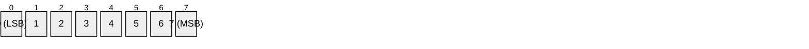
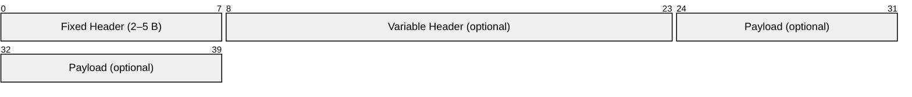
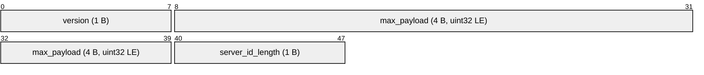
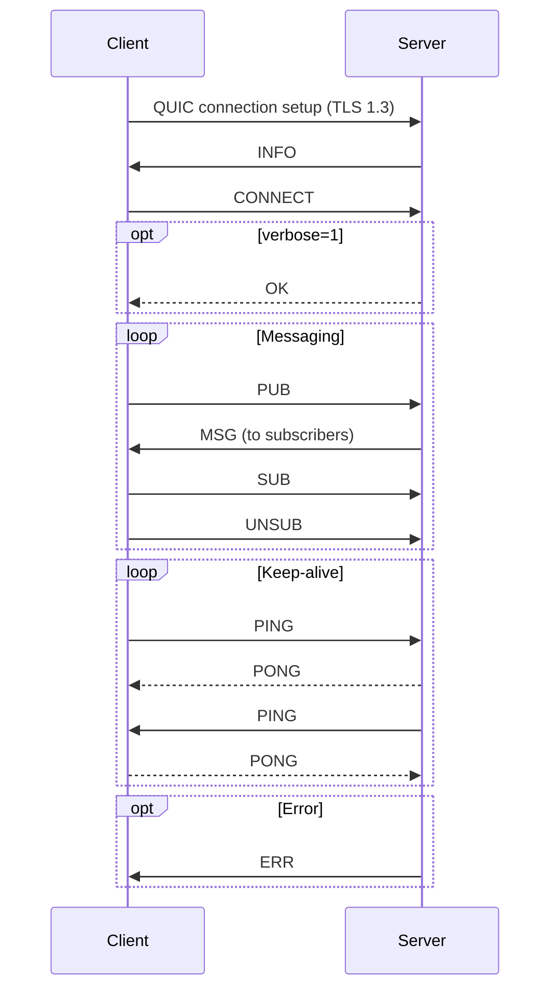

- **Version**: 0 (Draft)
- **Status**: Work in Progress

## Overview

Ocypode communicates using a custom binary protocol designed for stable,
high-performance Pub/Sub messaging. The protocol is built on top of **QUIC**,
which provides encrypted communication via **TLS 1.3** by default and offers
more reliable transport than TCP-based protocols.

### Design Goals

- Low bandwidth overhead through compact binary encoding
- Simple Pub/Sub messaging semantics
- Minimal parsing complexity for high-throughput implementations
- Efficient operation on modern hardware (x86_64, AArch64)

## Notation Conventions

### Byte Order

All multi-byte integer fields in this protocol are encoded in
**little-endian** byte order.

**Rationale**: The dominant processor architectures today — x86_64 and AArch64
(running in little-endian mode) — natively use little-endian byte order.
Adopting little-endian for the wire format eliminates byte-swap overhead on
these platforms, allows zero-copy type casting for fixed-size fields, and
simplifies implementation.

### Bit Numbering

Bit positions within a byte are numbered from **0** (least significant bit) to
**7** (most significant bit).



Note:

- Bits are numbered 0..7 where 0 = LSB and 7 = MSB.
- The diagram shows logical bit positions inside a byte.
  Multi-byte numeric fields are encoded in little-endian on the wire (see
  "Byte Order" above); the diagram does not change the endianness semantics.
- Where ranges are shown in diagrams they must be ascending (start ≤ end) to
  comply with rendering tools.

### Reserved Fields

All reserved bits and fields **MUST** be set to `0` by the sender and **MUST**
be ignored by the receiver.

### String Encoding

All string fields (topic names, server IDs, etc.) are encoded as **UTF-8**.
String fields are always preceded by an explicit length field; they are **not**
null-terminated.

### Variable-Length Integer (varint)

Some length fields use a variable-length integer encoding to represent values
compactly. The encoding works as follows:

- Each byte contributes 7 bits of payload (bits 0–6).
- Bit 7 (MSB) is a **continuation flag**: `1` means more bytes follow, `0`
  means this is the final byte.
- Bytes are ordered **least significant group first** (consistent with
  little-endian convention).
- Maximum encoding length is **4 bytes**, representing values up to
  `0x0FFFFFFF` (268,435,455).

| Bytes | Value Range             |
| ----- | ----------------------- |
| 1     | 0 – 127                 |
| 2     | 128 – 16,383            |
| 3     | 16,384 – 2,097,151      |
| 4     | 2,097,152 – 268,435,455 |

**Encoding example** — the value `300` (`0x012C`):

```text
  300 = 0b1_0010_1100

  Byte 0: 0b1_0101100  = 0xAC  (lower 7 bits = 0x2C, continuation = 1)
  Byte 1: 0b0_0000010  = 0x02  (upper bits = 0x02, continuation = 0)

  Wire bytes: [0xAC, 0x02]
```

### Terminology

| Term              | Definition                                                                    |
| ----------------- | ----------------------------------------------------------------------------- |
| **Client**        | An application that connects to an Ocypode server.                            |
| **Server**        | An Ocypode server instance that routes messages.                              |
| **Topic**         | A named subject string used to route published messages to subscribers.       |
| **Payload**       | The application data carried by `PUB` and `MSG` messages.                     |
| **Queue Group**   | A named group of subscribers that share message delivery (load balancing).    |

## Transport Layer

The Ocypode protocol operates over **QUIC** streams. Each protocol message is
framed as described in this document; QUIC provides the underlying encryption,
reliability, and flow control.

## Message Format

Every Ocypode protocol message consists of a **Fixed Header** followed by an
optional **Variable Header** and an optional **Payload**, depending on the
command type.



Note:

- The diagram shows logical byte ranges and is intended to be illustrative.
- For variable-length fields, the diagram indicates starting offsets;
  consult the textual field descriptions for exact parsing.

### Fixed Header

The fixed header is present in **every** message.


Clarification:

- Byte 0:
  - Bits 4–7 carry the `command` (4 bits).
  - Bits 0–3 carry the `flags` (4 bits).
- Bit numbering uses 0 = LSB ... 7 = MSB.
- The `remaining_length` immediately follows byte 0 and is encoded as the
  varint described earlier (least-significant-group first).
- The textual field descriptions (e.g., "Bits 7–4 of byte 0") remain
  authoritative; the diagram is a visual aid only.

| Field              | Bits / Size        | Description                                                                                         |
| ------------------ | ------------------ | --------------------------------------------------------------------------------------------------- |
| `command`          | Bits 7–4 of byte 0 | Command type identifier (see Command Table).                                                        |
| `flags`            | Bits 3–0 of byte 0 | Flags specific to each command. Unused bits MUST be `0`.                                            |
| `remaining_length` | 1–4 bytes (varint) | Total byte size of the variable header and payload that follow. `0` when neither is present.        |

### Variable Header

Command-specific fields that follow the fixed header. Fixed-size prefix fields
are shown in compact diagrams for readability; variable-length fields are
described with exact byte-range formulas relative to the start of the variable
header (offset 0 is the first byte of the variable header). Use the parsing
steps to calculate concrete offsets during implementation.

### Payload

Application data. Present only in commands that carry user content (`PUB`,
`MSG`).

## Command Table

| Command    | Code  | Sender | Description                                                     |
| ---------- | ----- | ------ | --------------------------------------------------------------- |
| `RESERVED` | `0x0` | —      | Reserved. MUST NOT be sent.                                     |
| `INFO`     | `0x1` | Server | Server information sent after QUIC connection is established.   |
| `CONNECT`  | `0x2` | Client | Client connection request with credentials and options.         |
| `PUB`      | `0x3` | Client | Publish a message to a topic.                                   |
| `SUB`      | `0x4` | Client | Subscribe to a topic.                                           |
| `UNSUB`    | `0x5` | Client | Cancel a subscription.                                          |
| `MSG`      | `0x6` | Server | Deliver a message to a subscriber.                              |
| `PING`     | `0x7` | Both   | Keep-alive probe.                                               |
| `PONG`     | `0x8` | Both   | Keep-alive response.                                            |
| `OK`       | `0x9` | Server | Acknowledgement (verbose mode).                                 |
| `ERR`      | `0xA` | Server | Protocol error notification.                                    |

Command codes `0xB`–`0xF` are reserved for future use.

## Command Definitions

---

### INFO

**Direction**: Server → Client

After a QUIC connection is established, the server sends an `INFO` message
containing server metadata and configuration. The client MUST wait for this
message before sending `CONNECT`.

#### Flags

All reserved (MUST be `0`).

#### Variable Header (fixed prefix shown)

The variable header begins with fixed-size fields followed by variable-length
fields. The mermaid diagram below shows the fixed prefix (fields with
deterministic size). Variable-length fields are listed in prose with exact
byte-range formulas relative to the start of the variable header (variable
header offset 0).



Variable fields and exact byte-range formulas (offsets are relative to
variable header start):

- `server_id`:
  - Start offset: 48
  - End offset: 48 + server_id_length - 1
  - Byte-range formula: bytes 48..(48 + server_id_length - 1)
- `server_name_length`:
  - Start offset: 48 + server_id_length
  - End offset: start (single byte)
  - Byte-range: byte (48 + server_id_length)
- `server_name`:
  - Start offset: 49 + server_id_length
  - End offset: 49 + server_id_length + server_name_length - 1
  - Byte-range formula:
    bytes (49 + server_id_length)..
    (49 + server_id_length + server_name_length - 1)
- `capability_flags`:
  - Start offset: 49 + server_id_length + server_name_length
  - End offset: same (single byte)
  - Byte-range: byte (49 + server_id_length + server_name_length)

Parsing steps (authoritative):

1. Read `version` (variable header offset 0).
2. Read `max_payload` (offsets 8..11 relative to variable header start).
3. Read `server_id_length` (offset 40).
4. Read `server_id` of `server_id_length` bytes at offsets
   48..(48+server_id_length-1).
5. Read `server_name_length` (1 byte) at offset
   (48 + server_id_length).
6. Read `server_name` of `server_name_length` bytes at offsets
   (49 + server_id_length)..
   (49 + server_id_length + server_name_length - 1).
7. Read `capability_flags` at offset
   (49 + server_id_length + server_name_length).

| Field                | Type        | Size                  | Description                                                      |
| -------------------- | ----------- | --------------------- | ---------------------------------------------------------------- |
| `version`            | uint8       | 1 byte                | Server protocol version.                                         |
| `max_payload`        | uint32 (LE) | 4 bytes               | Maximum payload size in bytes. Default: `1,048,576` (1 MiB).     |
| `server_id_length`   | uint8       | 1 byte                | Length of `server_id` in bytes.                                  |
| `server_id`          | UTF-8       | `server_id_length`    | Unique server identifier.                                        |
| `server_name_length` | uint8       | 1 byte                | Length of `server_name` in bytes.                                |
| `server_name`        | UTF-8       | `server_name_length`  | Human-readable server name.                                      |
| `capability_flags`   | uint8       | 1 byte                | Bitfield (see below).                                            |

**`capability_flags` bits**:

| Bit | Name            | Description                                                           |
| --- | --------------- | --------------------------------------------------------------------- |
| 0   | `auth_required` | `1` if the server requires authentication in `CONNECT`.               |
| 1   | `headers`       | `1` if the server supports message headers (`PUB`/`MSG`).             |
| 2–7 | reserved        | MUST be `0`.                                                          |

---

### CONNECT

**Direction**: Client → Server

Sent by the client after receiving `INFO`. Contains the client's protocol
version, options, and optional authentication credentials.

#### Flags

| Bit | Name       | Description                                                               |
| --- | ---------- | ------------------------------------------------------------------------- |
| 0   | `verbose`  | `1`: server sends `OK` after each successfully processed message.         |
| 1   | `has_auth` | `1`: authentication fields are present in the variable header.            |
| 2–3 | reserved   | MUST be `0`.                                                              |

#### Variable Header (fixed prefix shown)


Variable fields and exact byte-range formulas (offsets relative to variable
header start):

- If `has_auth = 1`:
  - `auth_type`: byte at offset 8 (byte 8).
  - `auth_payload_length` (varint): starts at offset 9 and occupies 1–4
    bytes. Let auth_payload_length_varint_size be the varint size in bytes;
    the varint occupies offsets 9..(9 + auth_payload_length_varint_size - 1).
  - `auth_payload`: starts at offset (9 + auth_payload_length_varint_size) and
    spans `auth_payload_length` bytes. Byte-range:
    (9 + auth_payload_length_varint_size)..
    (9 + auth_payload_length_varint_size + auth_payload_length - 1)
- If `has_auth = 0`:
  - No fields follow `version`.

Parsing steps:

1. Read `version` at offset 0.
2. If `has_auth=1`:
   a. Read `auth_type` at offset 8.
   b. Read the varint `auth_payload_length` starting at offset 9 (varint
      size 1–4 bytes).
   c. Read `auth_payload` of length `auth_payload_length` starting
      immediately after the varint.

| Field                 | Type   | Size                  | Description                                              |
| --------------------- | ------ | --------------------- | -------------------------------------------------------- |
| `version`             | uint8  | 1 byte                | Client protocol version.                                 |
| `auth_type`           | uint8  | 1 byte                | Authentication method. Only present when `has_auth=1`.   |
| `auth_payload_length` | varint | 1–4 bytes             | Byte length of `auth_payload`. Only when `has_auth=1`.   |
| `auth_payload`        | bytes  | `auth_payload_length` | Authentication data. Only present when `has_auth=1`.     |

**`auth_type` values**:

| Value | Method   | `auth_payload` Format                                                                                                                          |
| ----- | -------- | ---------------------------------------------------------------------------------------------------------------------------------------------- |
| `1`   | Password | `username_length` (uint8, 1 B) + `username` (UTF-8, max 255 B) + `password_length` (uint8, 1 B) + `password` (UTF-8, max 255 B)                |
| `2`   | JWT      | `token_length` (uint16 LE, 2 B) + `token` (UTF-8)                                                                                              |

---

### PUB

**Direction**: Client → Server

Publishes a message to the specified topic.

#### Flags

| Bit | Name         | Description                               |
| --- | ------------ | ----------------------------------------- |
| 0   | `has_header` | `1`: optional header section is present.  |
| 1–3 | reserved     | MUST be `0`.                              |

#### Variable Header & Payload (fixed-prefix shown)


Variable fields and exact byte-range formulas (offsets relative to variable
header start):

- `topic`:
  - Start offset: 16
  - End offset: 16 + topic_length - 1
  - Byte-range formula: bytes 16..(16 + topic_length - 1)
- If `has_header = 1`:
  - `header_size`:
    - Start offset: 16 + topic_length
    - End offset: 17 + topic_length
    - Byte-range:
      bytes (16 + topic_length)..
      (17 + topic_length)
    - (2 bytes, uint16 LE)
  - `header`:
    - Start offset: 18 + topic_length
    - End offset: 18 + topic_length + header_size - 1
    - Byte-range:
      bytes (18 + topic_length)..
      (18 + topic_length + header_size - 1)
- `payload_size` (varint):
  - Starts at offset:
    - If `has_header=1`: (18 + topic_length + header_size)
    - If `has_header=0`: (16 + topic_length)
  - Occupies 1–4 bytes; let payload_varint_start denote that start offset,
    and payload_varint_size be its byte length.
  - `payload`:
    - Start offset: payload_varint_start + payload_varint_size
    - End offset: payload_start + payload_size - 1
    - Byte-range formula:
      bytes (payload_varint_start + payload_varint_size)..
      (payload_varint_start + payload_varint_size + payload_size - 1)

Parsing steps:

1. Read `topic_length` at offsets 0..1 (relative to variable header).
2. Read `topic` at bytes 16..(16 + topic_length - 1).
3. If `has_header=1`, read `header_size` (2 bytes LE) at bytes
   (16 + topic_length)..(17 + topic_length), then `header` at bytes
   (18 + topic_length)..(18 + topic_length + header_size - 1).
4. Read `payload_size` varint at the offset that follows header (or topic if
   no header).
5. Read `payload` bytes of length `payload_size` following the varint.

| Field          | Type        | Size           | Description                                                     |
| -------------- | ----------- | -------------- | --------------------------------------------------------------- |
| `topic_length` | uint16 (LE) | 2 bytes        | Byte length of `topic`.                                         |
| `topic`        | UTF-8       | `topic_length` | Topic name. Maximum 256 bytes.                                  |
| `header_size`  | uint16 (LE) | 2 bytes        | Byte length of `header`. Only present when `has_header=1`.      |
| `header`       | bytes       | `header_size`  | Key-value header data. Only present when `has_header=1`.        |
| `payload_size` | varint      | 1–4 bytes      | Byte length of `payload`.                                       |
| `payload`      | bytes       | `payload_size` | Application data.                                               |

Implementation note: calculated offsets above are relative to the start of the
variable header (i.e., variable header offset 0). Fixed header bytes consume
preceding bytes on the wire; when implementing, add the fixed-header length to
compute absolute wire offsets if needed.

---

### SUB

**Direction**: Client → Server

Subscribes to a topic. Wildcard patterns are supported in the topic name.

#### Flags

| Bit | Name              | Description                               |
| --- | ----------------- | ----------------------------------------- |
| 0   | `has_queue_group` | `1`: queue group fields are present.      |
| 1–3 | reserved          | MUST be `0`.                              |

#### Variable Header (fixed-prefix shown)


Variable fields and exact byte-range formulas (offsets relative to variable
header start):

- `topic`:
  - Start offset: 16
  - End offset: 16 + topic_length - 1
  - Byte-range: bytes 16..(16 + topic_length - 1)
- `subscription_id_length`:
  - Start offset: 16 + topic_length
  - End offset: 17 + topic_length
  - Byte-range:
    bytes (16 + topic_length)..
    (17 + topic_length) (2 bytes, uint16 LE)
- `subscription_id`:
  - Start offset: 18 + topic_length
  - End offset: 18 + topic_length + subscription_id_length - 1
  - Byte-range:
    bytes (18 + topic_length)..
    (18 + topic_length + subscription_id_length - 1)
- If `has_queue_group = 1`:
  - `queue_group_length`:
    - Start offset: 18 + topic_length + subscription_id_length
    - Byte-range:
      byte (18 + topic_length + subscription_id_length)
  - `queue_group`:
    - Start offset: 19 + topic_length + subscription_id_length
    - End offset:
      19 + topic_length + subscription_id_length + queue_group_length - 1
    - Byte-range:
      bytes (19 + topic_length + subscription_id_length)..
      (19 + topic_length + subscription_id_length + queue_group_length - 1)

Parsing steps:

1. Read `topic_length` (2 bytes, little-endian) at VH_BASE + 0.
2. Read `topic` of `topic_length` bytes at VH_BASE + 2 (i.e. bytes 16..).
3. Read `subscription_id_length` (2 bytes, little-endian) immediately after
   topic.
4. Read `subscription_id` of `subscription_id_length` bytes.
5. If `has_queue_group=1`, read `queue_group_length` (1 byte) and then
   `queue_group`.

| Field                    | Type        | Size                     | Description                                                            |
| ------------------------ | ----------- | ------------------------ | ---------------------------------------------------------------------- |
| `topic_length`           | uint16 (LE) | 2 bytes                  | Byte length of `topic`.                                                |
| `topic`                  | UTF-8       | `topic_length`           | Topic name or wildcard pattern. Maximum 256 bytes.                     |
| `subscription_id_length` | uint16 (LE) | 2 bytes                  | Byte length of `subscription_id`.                                      |
| `subscription_id`        | bytes       | `subscription_id_length` | Client-assigned subscription identifier.                               |
| `queue_group_length`     | uint8       | 1 byte                   | Byte length of `queue_group`. Only present when `has_queue_group=1`.   |
| `queue_group`            | UTF-8       | `queue_group_length`     | Queue group name. Only present when `has_queue_group=1`.               |

---

### UNSUB

**Direction**: Client → Server

Cancels an existing subscription.

#### Flags

All reserved (MUST be `0`).

#### Variable Header (fixed-prefix shown)


Variable fields and exact byte-range formulas:

- `subscription_id`:
  - Start offset: 16
  - End offset: 16 + subscription_id_length - 1
  - Byte-range: bytes 16..(16 + subscription_id_length - 1)

Parsing:

1. Read `subscription_id_length` at offsets 0..1 (variable header).
2. Read `subscription_id` at bytes 16..(16 + subscription_id_length - 1).

| Field                    | Type        | Size                     | Description                                             |
| ------------------------ | ----------- | ------------------------ | ------------------------------------------------------- |
| `subscription_id_length` | uint16 (LE) | 2 bytes                  | Byte length of `subscription_id`.                       |
| `subscription_id`        | bytes       | `subscription_id_length` | Subscription identifier previously sent in `SUB`.       |

---

### MSG

**Direction**: Server → Client

Delivers a published message to a subscribed client.

#### Flags

| Bit | Name         | Description                               |
| --- | ------------ | ----------------------------------------- |
| 0   | `has_header` | `1`: optional header section is present.  |
| 1–3 | reserved     | MUST be `0`.                              |

#### Variable Header & Payload (fixed-prefix shown)


Variable fields and exact byte-range formulas (offsets relative to variable
header start):

- `topic`:
  - bytes 16..(16 + topic_length - 1)
- `subscription_id_length`:
  - bytes (16 + topic_length)..
    (17 + topic_length) (2 bytes, uint16 LE)
- `subscription_id`:
  - bytes (18 + topic_length)..
    (18 + topic_length + subscription_id_length - 1)
- If `has_header = 1`:
  - `header_size`:
    - bytes (18 + topic_length + subscription_id_length)..
      (19 + topic_length + subscription_id_length) (2 bytes LE)
  - `header`:
    - bytes (20 + topic_length + subscription_id_length)..
      (20 + topic_length + subscription_id_length + header_size - 1)
- `payload_size` (varint):
  - starts at offset:
    - If `has_header=1`:
      20 + topic_length + subscription_id_length + header_size
    - Else: 18 + topic_length + subscription_id_length
  - occupies 1–4 bytes
- `payload`:
  - follows the varint; start = payload_varint_start + payload_varint_size
  - ends at start + payload_size - 1

Parsing steps:

1. Read `topic_length` (offsets 0..1).
2. Read `topic` at bytes 16..(16 + topic_length - 1).
3. Read `subscription_id_length` at bytes
   (16 + topic_length)..
   (17 + topic_length).
4. Read `subscription_id` at bytes
   (18 + topic_length)..
   (18 + topic_length + subscription_id_length - 1).
5. If `has_header=1`, read `header_size` and `header` as above.
6. Read `payload_size` varint and then `payload`.

| Field                    | Type        | Size                     | Description                                                       |
| ------------------------ | ----------- | ------------------------ | ----------------------------------------------------------------- |
| `topic_length`           | uint16 (LE) | 2 bytes                  | Byte length of `topic`.                                           |
| `topic`                  | UTF-8       | `topic_length`           | Topic name. Maximum 256 bytes.                                    |
| `subscription_id_length` | uint16 (LE) | 2 bytes                  | Byte length of `subscription_id`.                                 |
| `subscription_id`        | bytes       | `subscription_id_length` | Subscription identifier matching a prior `SUB`.                   |
| `header_size`            | uint16 (LE) | 2 bytes                  | Byte length of `header`. Only present when `has_header=1`.        |
| `header`                 | bytes       | `header_size`            | Key-value header data. Only present when `has_header=1`.          |
| `payload_size`           | varint      | 1–4 bytes                | Byte length of `payload`.                                         |
| `payload`                | bytes       | `payload_size`           | Application data.                                                 |

---

### PING

**Direction**: Both (Client ↔ Server)

Keep-alive probe. The receiver MUST respond with a `PONG`.

#### Flags

All reserved (MUST be `0`).

#### Variable Header / Payload

None. `remaining_length` is `0`.

---

### PONG

**Direction**: Both (Client ↔ Server)

Response to a `PING`. MUST be sent promptly after receiving a `PING`. Failure
to respond within a server-defined timeout may result in connection
termination.

#### Flags

All reserved (MUST be `0`).

#### Variable Header / Payload

None. `remaining_length` is `0`.

---

### OK

**Direction**: Server → Client

Acknowledgement sent when the client's `CONNECT` message set `verbose=1`.
Confirms successful processing of the preceding client message.

#### Flags

All reserved (MUST be `0`).

#### Variable Header / Payload

None. `remaining_length` is `0`.

---

### ERR

**Direction**: Server → Client

Indicates a protocol error. Depending on the severity, the server MAY
terminate the connection after sending this message.

#### Flags

All reserved (MUST be `0`).

#### Variable Header (fixed prefix shown)


Byte-range (offsets relative to variable header start):

- `error_code`: bytes 0..1 (uint16 LE)

| Field        | Type        | Size    | Description                                             |
| ------------ | ----------- | ------- | ------------------------------------------------------- |
| `error_code` | uint16 (LE) | 2 bytes | Error code identifying the failure (see Error Codes).   |

## Error Codes

| Code     | Name                   | Description                                                             | Fatal |
| -------- | ---------------------- | ----------------------------------------------------------------------- | ----- |
| `0x0001` | `UNKNOWN_PROTOCOL`     | Unrecognized protocol version.                                          | Yes   |
| `0x0002` | `AUTH_FAILED`          | Authentication credentials are invalid.                                 | Yes   |
| `0x0003` | `AUTH_REQUIRED`        | Server requires authentication but none was provided.                   | Yes   |
| `0x0004` | `INVALID_TOPIC`        | Topic name is malformed or exceeds the maximum length.                  | No    |
| `0x0005` | `PAYLOAD_TOO_LARGE`    | Payload exceeds `max_payload`.                                          | No    |
| `0x0006` | `PARSE_ERROR`          | Message could not be parsed.                                            | Yes   |
| `0x0007` | `UNKNOWN_SUBSCRIPTION` | Subscription ID does not match any active subscription.                 | No    |

Error codes `0x0000` and `0x0008`–`0xFFFF` are reserved for future use.

Errors marked **Fatal = Yes** will cause the server to close the connection
after sending the `ERR` message.

## Connection Lifecycle



1. The client establishes a QUIC connection to the server.
2. The server sends an `INFO` message with its configuration.
3. The client sends a `CONNECT` message (with optional authentication).
4. If `verbose=1`, the server responds with `OK`.
5. The client may now send `PUB`, `SUB`, and `UNSUB` messages.
6. The server delivers matching published messages via `MSG`.
7. Either side may send `PING`; the receiver MUST reply with `PONG`.

## Appendix: Wire Format Examples

### PING Message

A `PING` message has no variable header or payload:

```text
  Byte 0: 0x70    command=0x7 (PING), flags=0x0
  Byte 1: 0x00    remaining_length=0

  Wire: [0x70, 0x00]
```

### PUB Message

Publishing `"Hello"` (5 bytes) to topic `"chat"` (4 bytes), no header:

```text
  Fixed Header:
    Byte 0: 0x30          command=0x3 (PUB), flags=0x0 (no header)
    Byte 1: 0x0B          remaining_length=11

  Variable Header (offsets relative to variable header start):
    Bytes 0..1: 0x04 0x00  topic_length=4 (uint16 LE)
    Bytes 16..19: "chat"     topic (4 bytes, UTF-8)
    Byte  20:   0x05       payload_size=5 (varint, 1 byte)

  Payload:
    Bytes 21..25: "Hello"   payload (5 bytes)

  Wire: [0x30, 0x0B, 0x04, 0x00, 0x63, 0x68, 0x61, 0x74, 0x05,
         0x48, 0x65, 0x6C, 0x6C, 0x6F]
```

Notes on interpreting byte-range formulas:

- All numeric offsets in the formulas above are relative to the start of the
  variable header (i.e., the first byte after the fixed header).
- When computing absolute wire offsets, add the length of the fixed header
  (which is 1 byte for the header byte plus the length of the varint
  `remaining_length`) to obtain absolute positions.
- Implementations should not rely on diagram end offsets for variable-length
  fields; instead, follow the length-prefix parsing steps provided for each
  command to determine exact positions.
